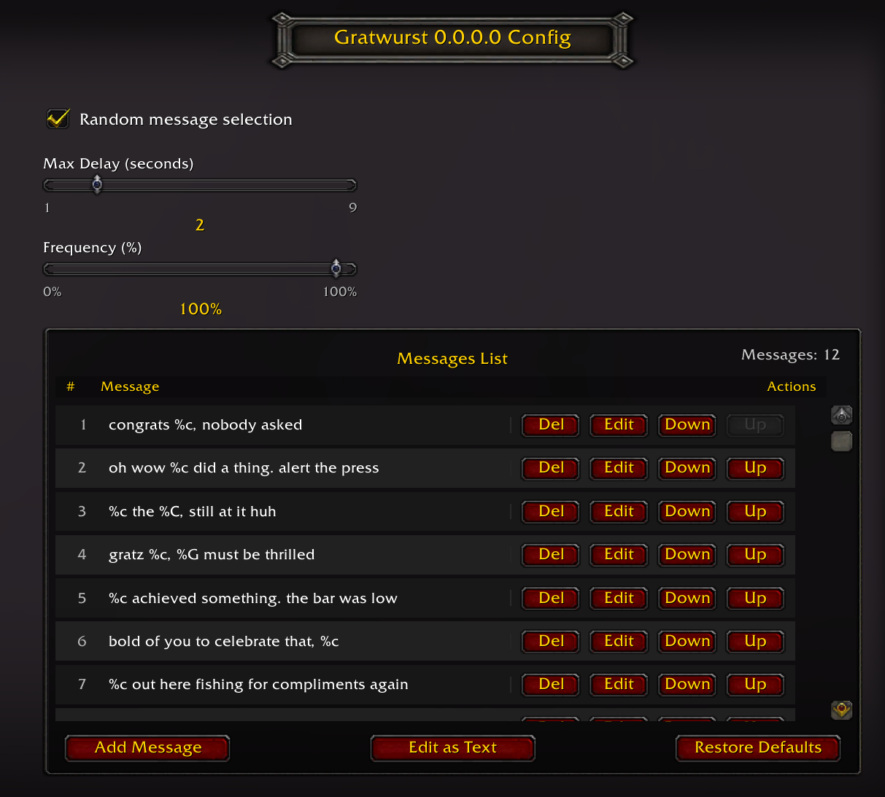
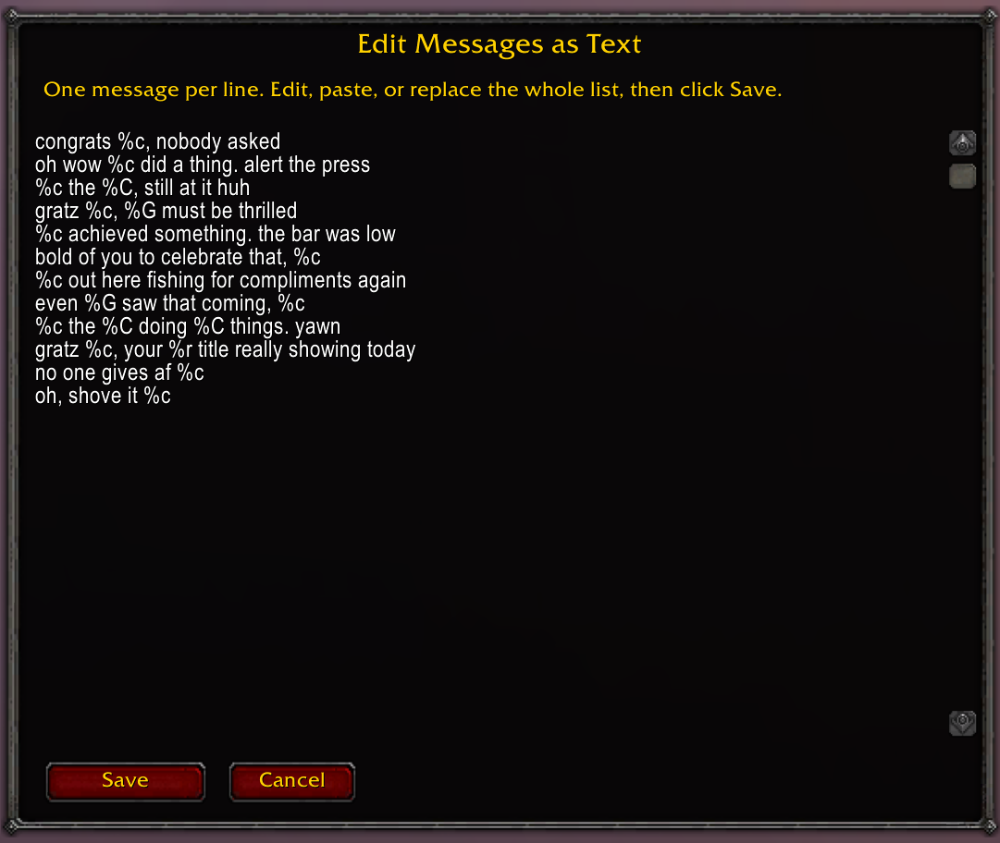

# Gratwurst
A delicious automatic congratulations messaging addon for World of Warcraft.

## Features

- Automatic grats for guild achievements
- Message list management (add/edit/delete/reorder)
- Optional random selection, delay, and frequency controls
- Placeholder support + live preview

## Usage

Gratwurst listens for guild achievements and (optionally) sends a randomized congratulatory message to guild chat.

Open the config via:
- `Settings` → `AddOns` → `Gratwurst`
- Or `/gw c`

### Message Management

The addon now features a modern listbox interface for managing your congratulatory messages:

- **Add Message**: Click the "Add Message" button to create new messages
- **Edit Message**: Click "Edit" on any message to modify it
- **Delete Message**: Click "Del" to remove unwanted messages
- **Reorder Messages**: Use ↑ and ↓ buttons to change message order
- **Restore Defaults**: Click "Restore Defaults" to reset to the built-in message list

### Settings

- **Random message selection**: random vs first message
- **Max Delay (seconds)**: random delay (1–9)
- **Frequency (%)**: chance to send a message

### Slash Commands

- `/gw c` (or `/gratwurst c`): open configuration
- `/gw enable`: enable the addon
- `/gw disable`: disable the addon
- `/gw debug`: print debug output and simulate a grats message locally

### Message Format

Gratwurst supports a placeholder system for message templates.

Common placeholders:
- `%c` character name
- `%l` level
- `%C` class
- `%g` short guild name (alias)
- `%G` full guild name
- `%r` guild rank

Legacy placeholder (still supported):
- `$player` inserts the character name

Tip: the Add/Edit dialogs show a full placeholder list and live preview.

The **Edit as Text** button opens a bulk editor — great for quickly adding, reorganizing, or replacing your entire message list at once. One message per line.

> **Pro tip:** Feed your placeholders to an AI and ask it to generate a list of messages! For example:
> *"Generate 20 sarcastic congratulations messages for a World of Warcraft guild addon. Use these placeholders where appropriate: `%c` (character name), `%C` (class), `%g` (short guild name), `%G` (full guild name), `%r` (guild rank), `%l` (level)."*
> Then paste the results straight into the bulk editor and hit Save.

## Development

### Quick Deploy

Run `\.\dev.ps1` to auto-detect your WoW install and copy the addon. Use `\.\dev.ps1 scan` if you have multiple installs.

`dev.ps1` commands: `copy` (default), `scan`, `backup`, `clean`, plus `-Beta` for `_beta_`.

## Contributing

### Bug Reports & Feature Requests

Please use the [issue tracker](https://github.com/bitobrian/Gratwurst/issues) to report any bugs or file feature requests.

### Developing

PRs are welcome!

### Tooling

Any text editor! Feel free to handwrite, scan, and ocr into Notepad!

### Thanks

#### Contributors

- [Server Restart In Podcast Crew](https://www.serverrestartin.com/)!

#### Github Action for packaging

[Vger Blizz Forum Post](https://us.forums.blizzard.com/en/wow/t/creating-addon-releases-with-github-actions/613424)

[Pawn Addon Source](https://github.com/VgerMods/Pawn)